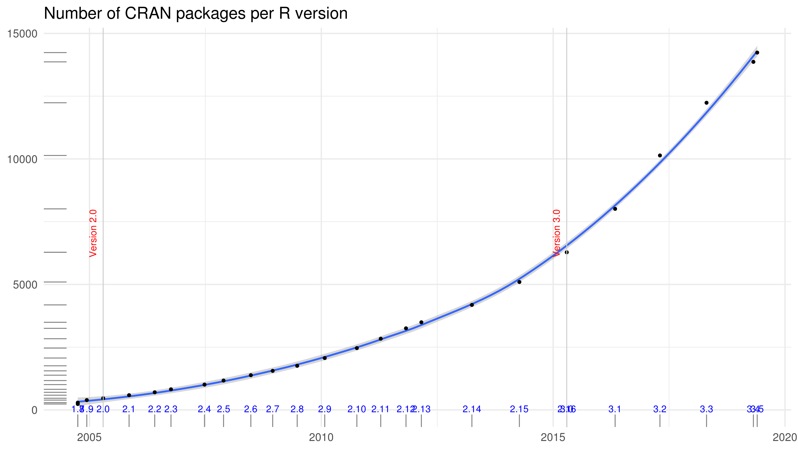

## manipulation de tables & visualisation sous R
### (avec tidyverse)

Frédéric Mahé, Etienne Loire, Florentin Constancias

6 juin 2019

<!-- ----------------------------------------------------------------

                            Prologue

    ----------------------------------------------------------------
-->

source:

https://github.com/frederic-mahe/tidyverse-fanclub-Montpellier-2019

## R & R Studio
#### born to rock

Note: notes réservées au mode présentation.

 <!-- .element height="20%" width="20%" -->

- 1993
- logiciel libre
- multi-plateforme
- modulaire et en forte croissance

popularité croissante

Note: SPSS à partir de 100 €/personne/mois

fonctionnalités croissantes
([code](https://blog.revolutionanalytics.com/2016/04/cran-package-growth.html))

Hadley Wickham, the Man Who Revolutionized R

### manipulation (unifiée) et visualisation de données

[grammar of graphics](https://www.springer.com/us/book/9780387245447) par Leland Wilkinson

- ggplot2,
- dplyr,
- tidyr,
- et beaucoup d'autres,
- Chief Scientist R Studio

<!-- two newlines for a new vertical slide  -->
<!-- three newlines for a new horizontal slide  -->
